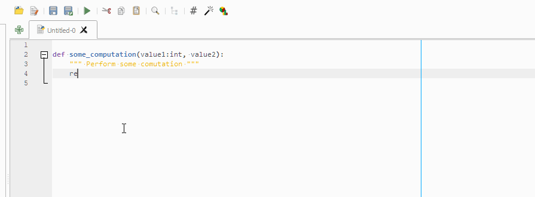
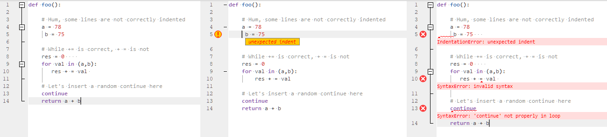

> **Warning**
>
> This plugin is **OBSOLETE** and is not guaranteed to work beyond QGIS 3.10.
>
> Some of its features will eventually be merged to QGIS:
> - ToggleComment (https://github.com/qgis/QGIS/pull/50341): 3.30
> - Smart brackets (https://github.com/qgis/QGIS/pull/51391): 3.30
> - Fix altgr shortcut (https://github.com/qgis/QGIS/pull/51420): 3.30
> - Format code (https://github.com/qgis/QGIS/pull/51733): 3.32
> - Save / Run / Tab shortcuts (https://github.com/qgis/QGIS/pull/51913): 3.32
> - Jedi features (autocompletion, calltips, goto): TBD

Better Editor (QGIS plugin)
===

This plugin improves the embedded Python editor with several useful features.

- Smart autocompletion and call tips with Jedi

- Replace comment / uncomment action with a single well-behaved Toggle comment action (`Ctrl+:`)

- Format code with [black formatter](https://github.com/psf/black) (`Ctrl+Alt+F` or Format on save)

- Better handling of `[{('""')}]` : automatic insertion and deletion
- Goto definition: press F12 or F2 will go to the definition of the word under the cursor (works only within the script)
- Insert icon from QGIS resources: useful for quick prototyping
- Tweak some QGIS shortcuts which prevented user from entering `}` and `|` in the console when keyboard used AZERTY (French) layout
- Pressing Ctrl+S and Ctrl+Shift+S triggers file save when editor has focus
- Pressing Ctrl+R triggers script run
- Tab navigation with `Ctrl+PgDown` and `Ctrl+PgUp`
- Multiple syntax error check with [jedi](https://github.com/davidhalter/jedi).

<i>Original, simple check (QGIS) and multi check (Jedi)</i>

Settings dialog
---

 
 - Hide default QGIS comment & uncomment actions
 - Set the max line length (will be used by the ruler, and black)
 - Set the autocompletion threshold (Autocompletion is not triggered for words shorther than the threshold)
 - Format on save applies black before saving file
 - Configure the ruler
 - Change the default folding indicator (QGIS default is `Plain`)

Resource browser
---

The resource browser allow to search through the embedded .qrc files to look for images to use as icon.

*Copyright © 2020 Yoann Quenach de Quivillic*

