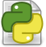

Python tools (QGIS plugin)
===

This plugin improves the embedded Python editor with several useful features.

- Tab navigation with `Ctrl+PgDown` and `Ctrl+PgUp`
- Replace comment / uncomment action with a single well-behaved Toggle comment action (`Ctrl+:`)

- Format code with [black formatter](https://github.com/psf/black) (`Ctrl+Alt+F`)

- Insert icon from QGIS resources: useful for quick prototyping
- Tweak some QGIS shortcuts which prevented user from entering `}` and `|` in the console when keyboard used AZERTY (French) layout

Settings dialog
---

 
 - Hide default QGIS comment & uncomment actions
 - Set the max line length (will be used by the ruler, and black)
 - Configure the ruler
 - Change the default folding indicator (QGIS default is `Plain`)

Resource browser
---

The resource browser allow to search through the embedded .qrc files to look for images to use as icon.

*Copyright © 2020 Yoann Quenach de Quivillic*

